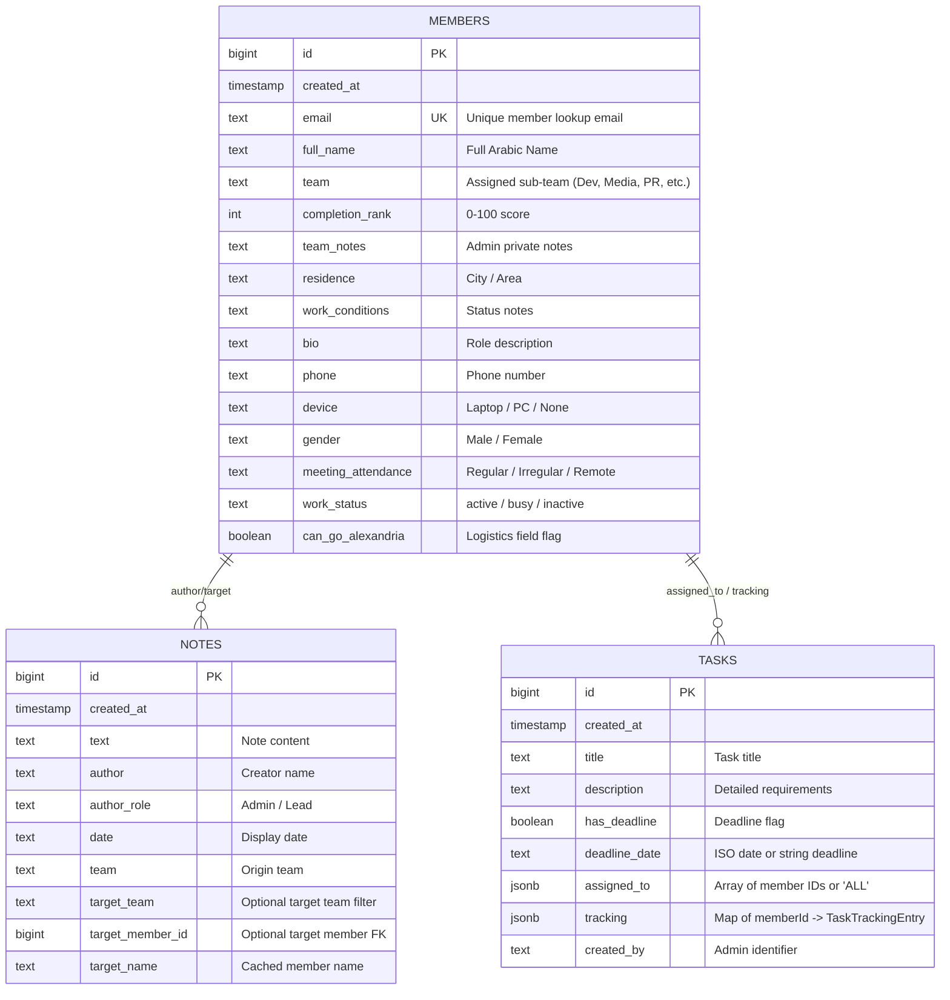

# PROJECT BLUEPRINT: Wasla Tech Management System (v2)

> **Document Version:** 2.0.0  
> **Status:** APPROVED & LOCKED ARCHITECTURE  
> **Target Audience:** Autonomous Coding Agents & Core Engineering Team  
> **Rule of Engagement:** This document is the single source of truth. Every instruction is written in MUST / MUST NOT / ALWAYS / NEVER rules. No implementation agent may deviate or improvise without explicit recorded human approval.

---

## 1. Project Overview
Wasla Tech Management System (v2) is a specialized, closed internal operations management platform and intelligence suite engineered specifically for the Wasla Tech team and its leadership. The system orchestrates member logistical readiness (device availability, location tracking, field attendance feasibility), task distribution and multi-stage lifecycle verification, member ranking and reward scoreboards, contextual team notes, and an agentic operational AI Assistant (Wasla AI) with execution capabilities. "Done" is defined as a fully responsive, RTL-native, dual-portal web application (Admin Control Center & Member Portal) backed by Supabase PostgreSQL, edge functions, and real-time client state management with zero compilation errors, full TypeScript type safety, and zero UI regressions.

---

## 2. Functional Requirements

### 2.1 Core MVP (Phase 1)
- **Dual-Portal Access & Authentication:**
  - **Admin Portal (`/admin/login`):** Strict Supabase Auth (Email + Password), session persistence, auto-refresh tokens, and protected routing.
  - **Member Portal (`/login` -> `/portal`):** Passwordless direct email lookup. Verifies active membership against `members.email` and creates a local member session.
- **Member Logistics & Readiness Management:**
  - Full CRUD for team members with comprehensive attributes: Full Name, Email (unique), Team/Sub-team, Device Specs, Residence, Travel Feasibility (e.g. Alexandria field availability), Work Conditions, Phone, Gender, and Status.
  - Interactive Search, Multi-Filter (by Team, Device, Attendance, Status), and Sorting.
  - Excel Import & Export via SheetJS (`xlsx`) with duplicate detection, schema sanitization, and atomic batch insertions.
- **Dynamic Task Engine & Verification Lifecycle:**
  - Task creation with title, rich description, deadline date/time toggle, target assignment (Single member, Multi-member array, or `ALL` active members).
  - Multi-stage Task Lifecycle:
    1. `pending`: Initial state upon assignment.
    2. `in_progress`: Member is actively working.
    3. `under_review`: Member submitted work with optional external link and notes.
    4. `approved`: Admin verified work, marked done, and credited completion score.
    5. `revision_requested`: Admin requested modifications with feedback notes.
- **Scoreboard & Ranking System:**
  - Automated calculation of member completion percentages and score badges.
  - Tiered ranking breakdown (Top performers, consistent contributors, needs attention).
  - Manual bonus point adjusters and administrative performance notes.
- **Operational Notes & Team Activity Log:**
  - Categorized note creation (General team note, Targeted sub-team note, Direct member note).
  - Historical chronological audit timeline with author attribution and timestamps.
- **Wasla AI Operational Assistant (Agentic):**
  - Live conversational interface in Admin Dashboard with streaming capability.
  - Scoped database context injection (live member count, delayed tasks, device readiness).
  - Agentic Tool Calling & Action Execution: AI can propose and trigger structured mutations (e.g., `create_task`, `update_member`, `assign_task`, `add_note`) with explicit user confirmation or automated execution.
  - Secure API proxy via Supabase Edge Function with secret extraction from Supabase Vault.

### 2.2 Phase 2 Scope (Post-MVP Enhancements)
- Automated Telegram / WhatsApp bot notifications for task assignments and deadline alerts.
- Offline-first Service Worker caching for poor connectivity environments.
- Granular Activity Log with undo/revert capabilities.

---

## 3. Non-Functional Requirements

- **Localization & Directionality:** 100% RTL-Native (Right-to-Left) Arabic layout with Cairo / Inter typography. Numbers formatted cleanly; English technical terms preserved in LTR where appropriate.
- **Performance & Latency:**
  - Initial Bundle Size: `< 350KB` gzipped.
  - First Contentful Paint (FCP): `< 0.8s` on 4G networks.
  - Client Query Cache Time: 5 minutes stale time for static lookups with TanStack React Query.
- **Responsiveness & Mobile-First Adaptation:**
  - Seamless layout transitions across Mobile (`< 640px`), Tablet (`640px - 1024px`), and Desktop (`> 1024px`).
  - Mobile bottom navigation bar for Member Portal; collapsible responsive sidebar for Admin Dashboard.
- **Reliability & Data Integrity:**
  - Optimistic UI updates with automatic rollback on Supabase mutation failure.
  - Zero data loss during Excel batch import via client-side pre-validation.

---

## 4. Comparable Projects & Research Notes

1. **Linear / Plane (Issue & Task Tracking):**
   - *Adopted:* Clean state-machine task lifecycle (`pending` -> `in_progress` -> `under_review` -> `approved`), lightweight modal dialogs, keyboard shortcuts.
   - *Deliberately Avoided:* Complex sprint planning and heavy multi-workspace overhead unnecessary for an internal squad.
2. **Retool / Appsmith (Internal Operations Portals):**
   - *Adopted:* High-density data tables, fast multi-attribute filtering, batch import/export.
   - *Deliberately Avoided:* Bloated drag-and-drop runtime overhead; replaced with custom tailored Tailwind components.
3. **Supabase Studio / Dashboard:**
   - *Adopted:* Clean token-based CSS theme switching (Dark/Light), fast relational lookup, Supabase Auth + RLS security model.

---

## 5. Tech Stack Decision & Trade-offs

| Component | Choice | Evaluated Alternatives | Rationale & Trade-off |
|---|---|---|---|
| **Core Framework** | **React 19 + Vite 6** | Next.js, Remix, Vanilla JS | Instant HMR, zero SSR deployment overhead, perfect for client-side internal admin SPA hosted on Vercel/Static CDN. |
| **Language** | **TypeScript 5.x / 6.x** | Pure JavaScript | Strict interfaces eliminate runtime null/undefined crashes and enforce db contract sync. |
| **Styling** | **Tailwind CSS v4 + Design Tokens** | Raw CSS, Styled-Components, MUI | Eliminates stylesheet drift, guarantees token uniformity, zero runtime CSS-in-JS performance penalty. |
| **Routing** | **React Router DOM v7** | TanStack Router | Mature community, robust nested routes, protected layout wrappers for Dual-Portal model. |
| **Client State** | **Zustand v5** | Redux Toolkit, Context API | Minimal boilerplate (< 1KB), outside-React access, no unnecessary re-renders. |
| **Server State** | **TanStack React Query v5** | `useEffect` + `fetch`, SWR | Built-in caching, deduplication, automatic refetch on window focus, optimistic mutations. |
| **Database & Auth** | **Supabase (PostgreSQL + RLS)** | Firebase, Custom Express/MongoDB | Built-in Auth, PostgreSQL relational integrity, SQL RPC functions, and Edge Functions. |
| **Excel Parser** | **SheetJS (xlsx)** | PapaParse, ExcelJS | Industry-standard binary parsing, supports `.xlsx`, `.xls`, `.csv` with zero server overhead. |
| **AI LLM Engine** | **Gemini 2.5 Flash / Groq via Edge Function** | Direct client-side API calls | Edge Function safeguards API keys in Supabase Vault; sub-second inference speeds. |

---

## 6. Data Model & Database Schema



### 6.1 Database Migration DDL (`backend/supabase_setup.sql`)

```sql
-- 1. Enable UUID and Extensions
CREATE EXTENSION IF NOT EXISTS "uuid-ossp";

-- 2. Members Table
CREATE TABLE IF NOT EXISTS public.members (
    id BIGINT GENERATED BY DEFAULT AS IDENTITY PRIMARY KEY,
    created_at TIMESTAMP WITH TIME ZONE DEFAULT timezone('utc'::text, now()) NOT NULL,
    email TEXT UNIQUE NOT NULL,
    full_name TEXT NOT NULL,
    team TEXT,
    completion_rank INT DEFAULT 0 CHECK (completion_rank >= 0 AND completion_rank <= 100),
    team_notes TEXT,
    residence TEXT,
    work_conditions TEXT,
    bio TEXT,
    phone TEXT,
    device TEXT,
    gender TEXT,
    meeting_attendance TEXT,
    work_status TEXT DEFAULT 'active',
    can_go_alexandria BOOLEAN DEFAULT false
);

CREATE INDEX IF NOT EXISTS idx_members_email ON public.members (email);
CREATE INDEX IF NOT EXISTS idx_members_team ON public.members (team);

-- 3. Tasks Table
CREATE TABLE IF NOT EXISTS public.tasks (
    id BIGINT GENERATED BY DEFAULT AS IDENTITY PRIMARY KEY,
    created_at TIMESTAMP WITH TIME ZONE DEFAULT timezone('utc'::text, now()) NOT NULL,
    title TEXT NOT NULL,
    description TEXT,
    has_deadline BOOLEAN DEFAULT false,
    deadline_date TEXT,
    assigned_to JSONB DEFAULT '[]'::jsonb,
    tracking JSONB DEFAULT '{}'::jsonb
);

CREATE INDEX IF NOT EXISTS idx_tasks_created_at ON public.tasks (created_at DESC);

-- 4. Notes Table
CREATE TABLE IF NOT EXISTS public.notes (
    id BIGINT GENERATED BY DEFAULT AS IDENTITY PRIMARY KEY,
    created_at TIMESTAMP WITH TIME ZONE DEFAULT timezone('utc'::text, now()) NOT NULL,
    text TEXT NOT NULL,
    author TEXT,
    author_role TEXT,
    date TEXT,
    team TEXT,
    target_team TEXT,
    target_member_id BIGINT REFERENCES public.members(id) ON DELETE SET NULL,
    target_name TEXT
);

CREATE INDEX IF NOT EXISTS idx_notes_target_member ON public.notes (target_member_id);

-- 5. Row Level Security (RLS) Policies
ALTER TABLE public.members ENABLE ROW LEVEL SECURITY;
ALTER TABLE public.tasks ENABLE ROW LEVEL SECURITY;
ALTER TABLE public.notes ENABLE ROW LEVEL SECURITY;

-- Policy: Authenticated Admins have full access
CREATE POLICY "Admins full access to members" ON public.members FOR ALL TO authenticated USING (true) WITH CHECK (true);
CREATE POLICY "Admins full access to tasks" ON public.tasks FOR ALL TO authenticated USING (true) WITH CHECK (true);
CREATE POLICY "Admins full access to notes" ON public.notes FOR ALL TO authenticated USING (true) WITH CHECK (true);

-- Policy: Public / Anon (Members Portal) access for passwordless lookups & task status updates
CREATE POLICY "Anon read members by email" ON public.members FOR SELECT TO anon USING (true);
CREATE POLICY "Anon update task tracking" ON public.tasks FOR ALL TO anon USING (true) WITH CHECK (true);
CREATE POLICY "Anon read notes" ON public.notes FOR SELECT TO anon USING (true);
```

---

## 7. API & Function Boundaries

### 7.1 Supabase Client APIs (`frontend/src/lib/supabase/client.ts`)
- `getMembers()`: Fetches all members sorted by `completion_rank DESC`.
- `upsertMember(member: MemberInsert | MemberUpdate)`: Creates or updates member record.
- `bulkUpsertMembers(members: MemberInsert[])`: Batch creates/updates members from Excel.
- `deleteMember(id: number)`: Deletes member record.
- `getTasks()`: Fetches tasks with `tracking` map.
- `createTask(task: TaskInsert)`: Inserts new task and initializes tracking entries for all assigned members.
- `updateTaskStatus(taskId: number, memberId: number, status: TaskStatus, note?: string, submissionUrl?: string)`: Updates JSONB `tracking[memberId]`.
- `approveTaskSubmission(taskId: number, memberId: number, pointsBonus?: number)`: Admin marks status `approved` and increments member completion score.
- `getNotes()`: Fetches notes with optional target filtering.
- `createNote(note: NoteInsert)`: Inserts note.

### 7.2 Wasla AI Edge Function Contract (`/functions/v1/wasla-ai`)
- **Method:** `POST`
- **Headers:** `Authorization: Bearer <token | anon_key>`, `Content-Type: application/json`
- **Request Body:**
```json
{
  "question": "من هم أعضاء فريق التصميم المتاحين للنزول ومعهم لابتوب؟",
  "context": "JSON serialized snapshot of members, tasks, notes",
  "history": [
    { "role": "user", "parts": [{ "text": "..." }] },
    { "role": "model", "parts": [{ "text": "..." }] }
  ]
}
```
- **Response Shape (Success):**
```json
{
  "answer": "أعضاء فريق التصميم المتاحين هم: أحمد ومحمود.",
  "action": {
    "type": "create_task | update_member | add_note | assign_task | delete_member",
    "payload": { ... }
  }
}
```
- **Error Shape:**
```json
{ "error": "Detailed error string", "code": "UNAUTHORIZED | AI_API_ERROR | INVALID_PAYLOAD" }
```

---

## 8. Page/Screen-by-Screen Specification

### 8.1 Member Login (`/login` or `/`)
- **Purpose:** Fast, passwordless entry for team members to access their personal workspace.
- **Access:** Public.
- **Components:**
  - Wasla Brand Mark (Logo + Animated Ambient Accent).
  - Single input field: Email address (`dir="ltr"`, email validator).
  - "دخول سريع" (Quick Login) Action Button with loading state.
  - Link to Admin Login: "تسجيل دخول الإدارة ->" linking to `/admin/login`.
- **States:** Default, Submitting, Email Not Found Error, Active Session.
- **Actions:** On submission, checks `members` table for matching email. If found, stores `wasla_member_session` in `localStorage` + Zustand and navigates to `/portal`. If not found, shows: `"هذا البريد الإلكتروني غير مسجل في الفريق. تواصل مع الإدارة."`

### 8.2 Admin Login (`/admin/login`)
- **Purpose:** Secure authentication for team leads and system administrators.
- **Access:** Public (Admins only).
- **Components:**
  - Email & Password form with toggleable password visibility.
  - Theme toggle (Light/Dark mode).
  - Error alert card for invalid credentials.
  - Developer Mock Login button (disabled in production build).
- **Actions:** Authenticates against `supabase.auth.signInWithPassword`. On success, updates `useAuthStore` and redirects to `/admin/dashboard`.

### 8.3 Admin Dashboard (`/admin/dashboard` or `/admin`)
- **Purpose:** Central command center displaying team logistical readiness and operational health.
- **Access:** Authenticated Admins.
- **Components:**
  - **KPI Metrics Cards:** Total Members, Team Readiness Rate (%), Active Tasks Count, Delayed Deadlines Warning.
  - **Logistics Breakdown Chart/Grid:** Laptop vs PC vs None availability, Alexandria Field Attendance readiness percentage.
  - **Recent Activity Feed:** Latest notes and task status submissions.
  - **Quick Action Bar:** "إضافة مهمة جديدة", "استيراد إكسيل", "فتح المساعد الذكي".

### 8.4 Members Management & Excel Hub (`/admin/members`)
- **Purpose:** Complete team directory, individual profile editing, and batch Excel operations.
- **Access:** Authenticated Admins.
- **Components:**
  - Interactive Filter Bar (Sub-team dropdown, Device filter, Attendance filter, Search input).
  - Responsive Member Table: Avatar initial, Name, Role/Bio, Sub-team badge, Device, Completion % bar, Actions menu (Edit, Delete, Add Note).
  - **Excel Import Modal:** Drag-and-drop `.xlsx` file upload, real-time column mapping preview, duplicate detection, and import progress bar.
  - **Excel Export Button:** Instant generation of standardized team roster `.xlsx` file.
  - **Add/Edit Member Drawer Modal:** Form with input validation for all member fields.

### 8.5 Tasks Management & Review Center (`/admin/tasks`)
- **Purpose:** Task delegation, deadline monitoring, and submission verification workflow.
- **Access:** Authenticated Admins.
- **Components:**
  - **Create Task Modal:** Title, description, deadline picker, target selection (multi-select members or "كل الفريق").
  - **Kanban / List Views:** Filterable by status (`pending`, `in_progress`, `under_review`, `approved`).
  - **Submission Review Panel:** When a task is `under_review`, displays member submission notes and proof links with one-click **"اعتماد المهمة" (Approve & Credit Score)** or **"طلب تعديل" (Request Revision)**.

### 8.6 Ranking & Scoreboard (`/admin/ranking`)
- **Purpose:** Performance motivation and contribution leaderboard.
- **Access:** Authenticated Admins & Embedded View in Member Portal.
- **Components:**
  - Top 3 Podium Cards with distinct gold/silver/bronze badges.
  - Full Leaderboard Table: Rank #, Member, Team, Completed Tasks, Score %, Badges.
  - Quick Score Adjustment Modal (Bonus points for outstanding field initiatives).

### 8.7 Wasla AI Assistant (`/admin/assistant`)
- **Purpose:** Intelligent conversational partner for team logistics queries and agentic task execution.
- **Access:** Authenticated Admins.
- **Components:**
  - Chat stream interface with markdown rendering.
  - Preset Quick Prompt chips: "لخص جاهزية النزول القادم", "من متأخر في تسليم المهام؟", "أنشئ مهمة جديدة للتصميم".
  - **Action Proposal Cards:** When the AI triggers an action (e.g. creating a task), it renders an interactive approval card with preview buttons: `"تنفيذ الإجراء"` and `"إلغاء"`.

### 8.8 Member Workspace Portal (`/portal`)
- **Purpose:** Dedicated, streamlined interface for team members.
- **Access:** Authenticated Member (via email session).
- **Components:**
  - Member Header: Greeting, Sub-team, Personal Completion Score progress ring.
  - **My Tasks Section:**
    - Active assigned tasks card list.
    - Status switcher (`قيد التنفيذ`, `تم التسليم`).
    - Submission Modal: Input submission link (Google Drive, GitHub, Figma) and delivery notes.
  - **My Readiness Status:** One-click toggles for current device and field meeting attendance availability.
  - **Leaderboard Snippet:** Shows member's current standing among peers.

---

## 9. Design System & Visual Specification

```
/* Primary Theme Palette (Tokens) */
--primary: #6D28D9        (Wasla Royal Purple)
--primary-hover: #5B21B6  (Deep Purple)
--primary-light: #F3E8FF  (Soft Lavender Tint)
--accent: #7C3AED         (Electric Violet)

/* Semantic Colors */
--success: #10B981        (Emerald Green - Approved / Active)
--warning: #F59E0B        (Amber - Under Review / Deadline Approaching)
--danger: #EF4444         (Crimson - Delayed / Missing)
--info: #06B6D4           (Cyan - Announcements)

/* Surfaces & Typography */
--bg-light: #F8F9FA       --bg-dark: #0F172A
--card-light: #FFFFFF     --card-dark: #1E293B
--text-light: #111827     --text-dark: #F8FAFC
--font-family: 'Cairo', 'Segoe UI', system-ui, -apple-system, sans-serif;
```

### Layout & Component Design Rules
1. **Directionality:** Layout is strictly `dir="rtl"`. Icons with direction (arrows, chevrons) must be flipped appropriately for RTL.
2. **Spacing & Radii:** Base spacing unit `4px`. Component cards use `border-radius: 14px` (`var(--radius)`), nested inputs use `10px` (`var(--radius-sm)`).
3. **Elevations:** Soft layered shadows (`0 4px 6px -1px rgba(0,0,0,0.06)`). No harsh high-contrast black borders.

---

## 10. Security & Access Rules

1. **Authentication Boundary:**
   - Admin routes (`/admin/*`) MUST verify `supabase.auth.getSession()`. Unauthenticated requests redirect immediately to `/admin/login`.
   - Member portal routes (`/portal/*`) MUST verify active member email session in state/localStorage. Unauthenticated requests redirect to `/login`.
2. **Database Protection (Row Level Security):**
   - Direct SQL write operations on sensitive columns (e.g. `completion_rank`, admin notes) require admin auth.
   - Public/Anon member portal submissions are restricted to updating their specific tracking slot within `tasks.tracking` and reading member directories.
3. **API Key Safety:**
   - Groq API / Gemini AI API keys MUST NEVER exist in client-side `.env` files or bundles.
   - All AI calls route through Supabase Edge Function `wasla-ai`, retrieving credentials from `vault.decrypted_secrets`.
4. **Input Sanitization:**
   - All text inputs rendered from members or Excel imports MUST be sanitized to prevent Stored XSS attacks.

---

## 11. Build Rules for the Coding Agent

- **MUST**: Maintain strict TypeScript typing. Zero `any` types allowed in `src/`. All database interactions must use types from `src/types/db.ts`.
- **MUST NOT**: Write inline CSS styles. All styling must use Tailwind utility classes or tokens from `tokens.css`.
- **MUST**: Separate data fetching from UI components using custom React Query hooks (`useMembers`, `useTasks`, `useNotes`, etc.).
- **MUST**: Implement complete UI states for all asynchronous operations: `isLoading` (skeleton/spinner), `isError` (error card with retry button), `isEmpty` (illustrative empty state message), and `isSuccess`.
- **MUST NOT**: Break existing RTL styling or remove the dual-portal routing structure.
- **ALWAYS**: Validate JSON parsing from LLM edge functions with `try/catch` fallbacks to prevent runtime crashes.

---

## 12. Open Questions & Risks

1. **Member Authentication Scale:** Email-only lookup offers zero-friction access for internal team members. If the team grows beyond 100+ members or handles sensitive proprietary assets, migrate to Magic Link (OTP via Email/WhatsApp) in Phase 2.
2. **AI Action Verification:** All agentic actions proposed by Wasla AI (such as task deletion or member removal) MUST require explicit one-click UI confirmation by the Admin in the chat window before executing database mutations.
3. **Excel Column Header Sync:** The SheetJS import utility must support fuzzy Arabic header matching (e.g., `"الاسم"`, `"اسم العضو"`, `"الاسم بالكامل"` all map to `full_name`).

